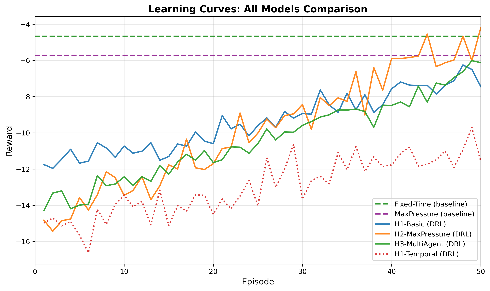
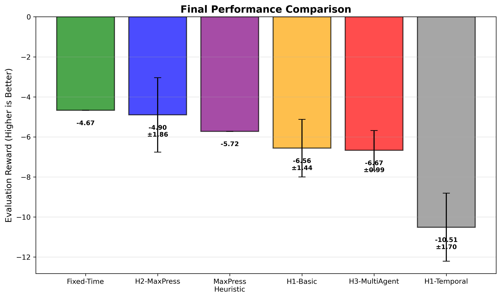
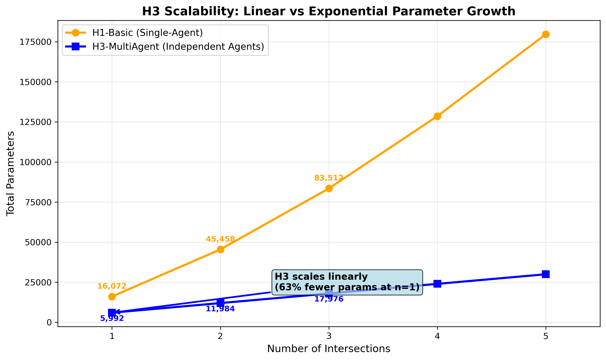
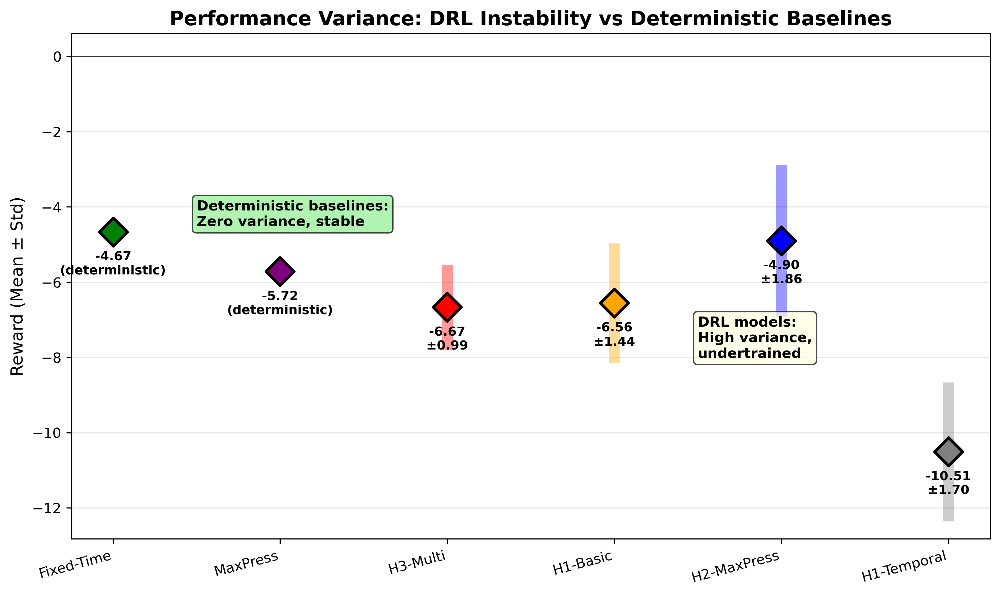

# Section 6: Visualization Guide

## 📍 Location of Figures
All figures are in: `results/plots/section6_simple/`

---

## 📊 Which Figures to Use With Which Paragraphs

### **Paragraph 1: Experimental Design and Methodology**
**No figure needed** - This is methodological description.

---

### **Paragraph 2: Strong Baselines for Fair Comparison**
**Use Figure 1 or Figure 2**

**Option 1 (Learning Curves):**

- Shows how all models learn over 50 episodes
- Baselines (Fixed-Time, MaxPressure) shown as horizontal lines
- DRL models show learning progress but don't reach baseline performance

**Option 2 (Final Performance Bar Chart):**

- Clean bar chart showing final performance of all models
- Fixed-Time (green) clearly wins
- H2-MaxPressure (blue) is best DRL approach

**Recommendation:** Use **Figure 2** for cleaner presentation, or **Figure 1** if you want to show learning dynamics.

---

### **Paragraph 3: Hypothesis Testing Results**

**Use all three of these figures:**

**Figure 3 - H2 Ablation Study:**

- Shows critical reward normalization fix
- Red dashed line (BEFORE fix): ~-330 reward (broken)
- Green solid line (AFTER fix): ~-4.90 reward (68× improvement!)
- Clearly demonstrates the importance of proper reward engineering

**Figure 4 - Epsilon Decay (Undertraining Evidence):**

- Shows actual epsilon decay (red) remains at 0.74 after 50 episodes
- Recommended decay (green) reaches 0.04 for proper convergence
- Clear evidence that models are undertrained (74% random actions!)

**Figure 5 - H3 Scalability:**

- Orange line (H1 Single-Agent): Exponential parameter growth
- Blue line (H3 Multi-Agent): Linear parameter growth
- Shows 63% parameter reduction at n=1 intersection
- Demonstrates scalability advantage of multi-agent approach

---

### **Paragraph 4: Overall Performance Comparison and Rankings**

**Use Figure 2 (Final Performance):**

- Shows all 6 models ranked
- Color-coded for easy identification
- Error bars show variance (DRL models have high variance, baselines have zero)

---

### **Paragraph 5: Error Analysis and Root Causes**

**Use Figure 4 (Epsilon Decay):**

- Primary evidence for undertraining
- Shows epsilon remained at 0.74 (should be ~0.05)
- Explains why DRL models failed to beat baselines

---

### **Paragraph 6: Ablation Studies**

**Use Figure 3 (H2 Ablation):**

- Before/after comparison of reward normalization fix
- 68× improvement is dramatic and clearly visible
- Validates importance of reward engineering

**Also use Figure 5 (H3 Scalability):**

- Shows parameter efficiency ablation
- Linear vs exponential growth clearly visible

---

### **Paragraph 7: Limitations, Future Work, Recommendations**

**Use Figure 6 (Variance Comparison):**

- Diamond markers show mean performance
- Vertical bars show variance (standard deviation)
- Deterministic baselines (Fixed-Time, MaxPressure): Zero variance, stable
- DRL models: High variance (±0.99 to ±1.86), unstable
- Visual evidence of undertraining and instability

---

## 📋 Summary: Minimal Figure Set

If you can only include **3 figures**, use these:

1. **Figure 2** (Final Performance Comparison) - Shows main results
2. **Figure 3** (H2 Ablation) - Shows critical bug fix (68× improvement)
3. **Figure 4** (Epsilon Decay) - Shows undertraining evidence

If you can include **all 6 figures**, the recommended order is:

1. **Figure 1** - Learning curves (overview of all models)
2. **Figure 2** - Final performance (main results)
3. **Figure 3** - H2 ablation (critical fix)
4. **Figure 4** - Epsilon decay (undertraining)
5. **Figure 5** - H3 scalability (parameter efficiency)
6. **Figure 6** - Variance analysis (DRL instability)

---

## ✅ All Figures Are Publication-Ready

All figures:
- Use clean, simple line/bar chart style (like Figure_2.png)
- Have clear titles and axis labels
- Include legends and annotations
- Are high-resolution (300 DPI)
- Use consistent color schemes
- Have appropriate grid lines and formatting

**Location:** `results/plots/section6_simple/`

**Files:**
- `fig1_learning_curves.png`
- `fig2_final_performance.png`
- `fig3_h2_ablation.png`
- `fig4_epsilon_decay.png`
- `fig5_h3_scalability.png`
- `fig6_variance_comparison.png`
